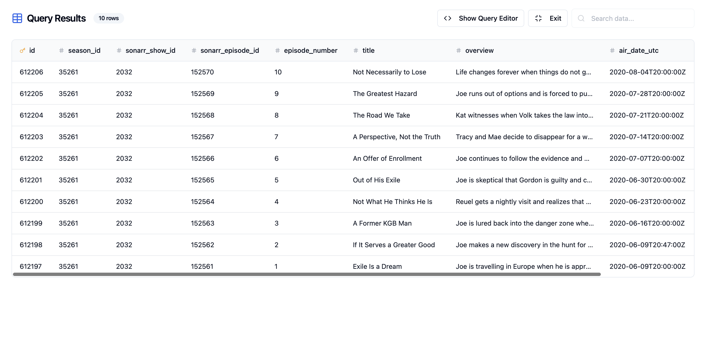
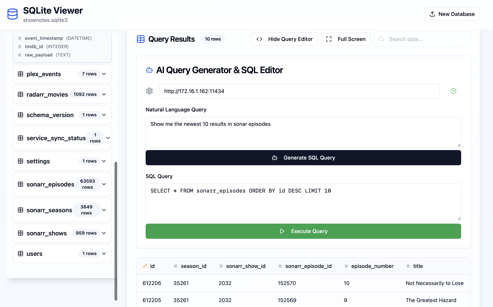
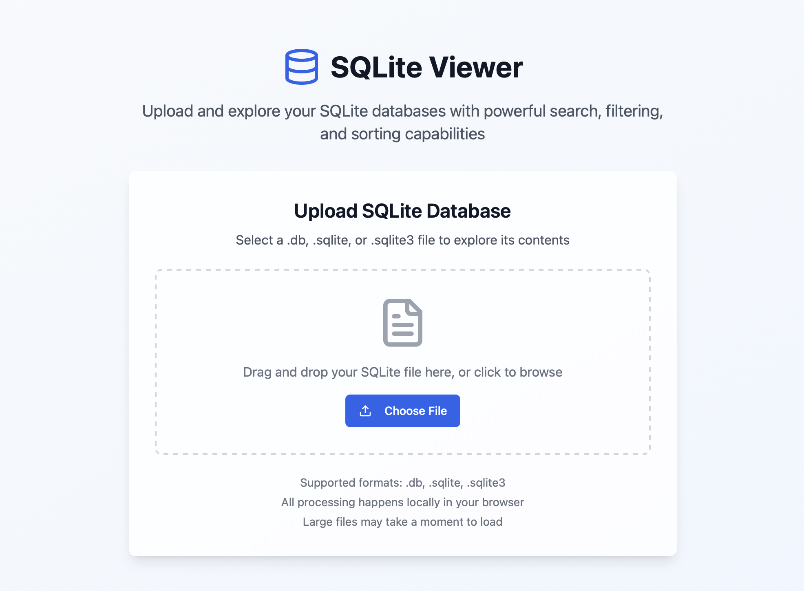
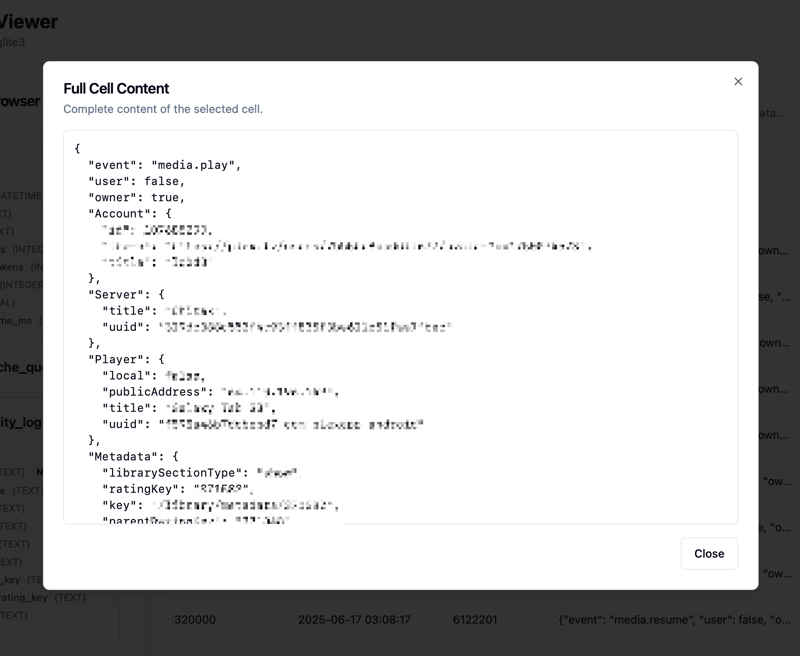

# SQLite Data Explorer Mobile

A modern, browser-based SQLite database explorer and editor. Effortlessly upload, browse, query, and edit SQLite databases with a beautiful, responsive UI. Features include schema browsing, table editing, AI-assisted query generation, and advanced cell viewing—all running locally in your browser.

---
## Features

- Upload and explore SQLite databases directly in the browser (no server required)
- View and browse database schema (tables, columns, types, PK, etc.)
- View, search, sort, and paginate table data
- Add, edit, and delete rows with a user-friendly UI
- Full cell content overlay for truncated/large cell values
- Automatic pretty-printing for JSON cell content in overlays
- Scrollable overlay for large cell content (horizontal and vertical)
- AI Query Generator: generate SQL queries from natural language using Ollama (configurable URL, persistent in localStorage)
- Execute custom SQL queries and view results
- Toast notifications for actions and errors
- Responsive design for desktop and mobile
- Modern UI with shadcn-ui and Tailwind CSS

## Screenshots

### Fullscreen Table View Mode

*View your data in a distraction-free, full-window mode for easier analysis and navigation.*

### Ollama-Assisted Query Editor

*Generate SQL queries from natural language using the integrated AI Query Editor powered by Ollama.*

### Upload to View

*Quickly upload your SQLite database file to start exploring its schema and data instantly.*

### View Formatted Cell Content

*Easily inspect large or JSON-formatted cell values in a scrollable, pretty-printed overlay.*

---

See [ROADMAP.md](./ROADMAP.md) for planned and potential future features.

## Project info

**URL**: https://lovable.dev/projects/1f3e33d4-d082-4ae3-9334-309042291bf6

## How can I edit this code?

There are several ways of editing your application.

**Use Lovable**

Simply visit the [Lovable Project](https://lovable.dev/projects/1f3e33d4-d082-4ae3-9334-309042291bf6) and start prompting.

Changes made via Lovable will be committed automatically to this repo.

**Use your preferred IDE**

If you want to work locally using your own IDE, you can clone this repo and push changes. Pushed changes will also be reflected in Lovable.

The only requirement is having Node.js & npm installed - [install with nvm](https://github.com/nvm-sh/nvm#installing-and-updating)

Follow these steps:

```sh
# Step 1: Clone the repository using the project's Git URL.
git clone <YOUR_GIT_URL>

# Step 2: Navigate to the project directory.
cd <YOUR_PROJECT_NAME>

# Step 3: Install the necessary dependencies.
npm i

# Step 4: Start the development server with auto-reloading and an instant preview.
npm run dev
```

**Edit a file directly in GitHub**

- Navigate to the desired file(s).
- Click the "Edit" button (pencil icon) at the top right of the file view.
- Make your changes and commit the changes.

**Use GitHub Codespaces**

- Navigate to the main page of your repository.
- Click on the "Code" button (green button) near the top right.
- Select the "Codespaces" tab.
- Click on "New codespace" to launch a new Codespace environment.
- Edit files directly within the Codespace and commit and push your changes once you're done.

## What technologies are used for this project?

This project is built with:

- Vite
- TypeScript
- React
- shadcn-ui
- Tailwind CSS

## How can I deploy this project?

Simply open [Lovable](https://lovable.dev/projects/1f3e33d4-d082-4ae3-9334-309042291bf6) and click on Share -> Publish.

## Can I connect a custom domain to my Lovable project?

Yes, you can!

To connect a domain, navigate to Project > Settings > Domains and click Connect Domain.

Read more here: [Setting up a custom domain](https://docs.lovable.dev/tips-tricks/custom-domain#step-by-step-guide)

## Running the Dev Server on Boot (Linux/systemd)

To automatically start the Vite dev server when your server boots, use systemd:

1. **Create a systemd service file:**
   ```sh
   sudo nano /etc/systemd/system/sqlite-data-explorer.service
   ```
   Paste the following (edit paths and user as needed):
   ```ini
   [Unit]
   Description=SQLite Data Explorer Vite Dev Server
   After=network.target

   [Service]
   Type=simple
   User=scott
   WorkingDirectory=/home/scott/sqlite-data-explorer-mobile
   ExecStart=/usr/bin/npm run dev
   Restart=always
   Environment=PATH=/usr/bin:/usr/local/bin
   Environment=NODE_ENV=development

   [Install]
   WantedBy=multi-user.target
   ```

2. **Reload systemd and enable the service:**
   ```sh
   sudo systemctl daemon-reload
   sudo systemctl enable sqlite-data-explorer
   sudo systemctl start sqlite-data-explorer
   ```

3. **Check status and logs:**
   ```sh
   sudo systemctl status sqlite-data-explorer
   journalctl -u sqlite-data-explorer -f
   ```

This will keep your dev server running in the background and restart it if it crashes. For production, consider building and serving static files with a production server.

